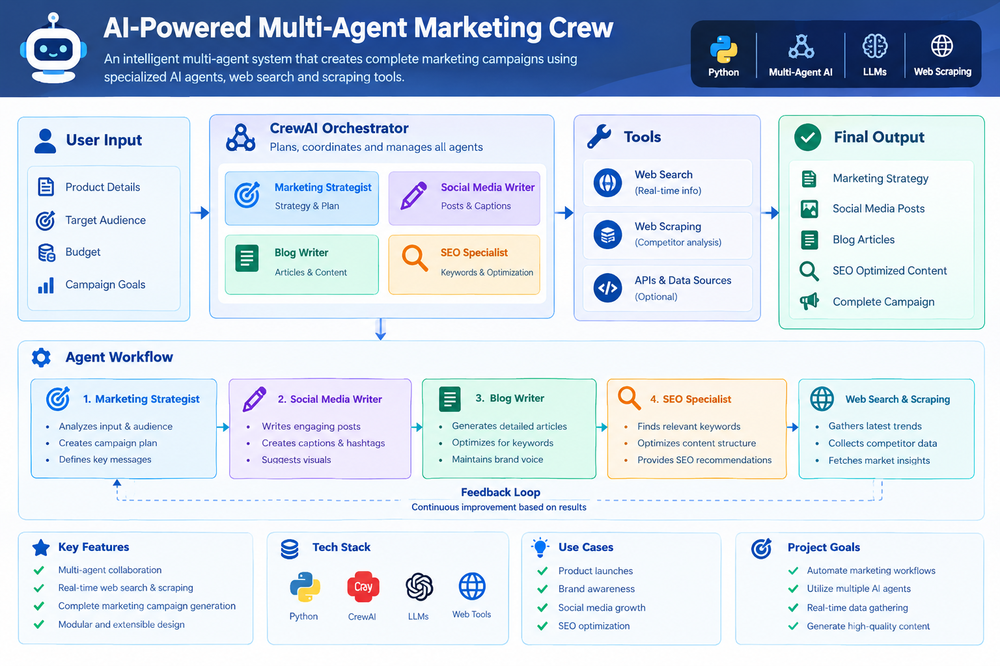

# 🤖 AI-Powered Multi-Agent Marketing Crew

An **agentic AI marketing system** built with **CrewAI** that uses multiple specialized AI agents to collaborate on marketing tasks. The crew consists of a **Head of Marketing, Creative Content Creator, Content Writer, and SEO Specialist**, with each agent responsible for a specific part of the marketing workflow.

The system coordinates these specialized agents to transform a marketing requirement into structured, high-quality marketing content.

---

## 🧠 Project Architecture



The system follows a multi-agent workflow where each specialized agent performs a specific task and contributes to the final marketing output.

---

## ✨ Key Features

- 🤖 **Multi-Agent AI Architecture**
- 👨‍💼 Head of Marketing for campaign planning and coordination
- 🎨 Creative Content Creator for creative marketing ideas
- ✍️ Content Writer for generating marketing content
- 🔍 SEO Specialist for search-engine optimization
- 🔄 Agent-to-agent task collaboration using CrewAI
- 📝 Automated content generation
- 💾 Saves generated drafts for further use
- 🔐 Environment-based API key configuration
- 🧩 Modular and extensible agent architecture

---

## 🏗️ Agentic Workflow

```text
                    ┌─────────────────────┐
                    │     User Input      │
                    │ Marketing Objective │
                    └──────────┬──────────┘
                               │
                               ▼
                    ┌─────────────────────┐
                    │   Head of Marketing │
                    │   Strategy & Plan   │
                    └──────────┬──────────┘
                               │
                    ┌──────────┴──────────┐
                    ▼                     ▼
          ┌──────────────────┐   ┌──────────────────┐
          │ Creative Content │   │  Content Writer  │
          │     Creator      │   │                  │
          └────────┬─────────┘   └────────┬─────────┘
                   │                      │
                   └──────────┬───────────┘
                              ▼
                    ┌─────────────────────┐
                    │   SEO Specialist    │
                    │ Keywords & SEO       │
                    └──────────┬──────────┘
                               │
                               ▼
                    ┌─────────────────────┐
                    │   Final Marketing   │
                    │       Output        │
                    └─────────────────────┘
```

---

## 👥 AI Agents

### 1. 👨‍💼 Head of Marketing

Responsible for understanding the marketing objective and creating the overall strategy.

**Responsibilities:**
- Analyze the marketing requirement
- Define campaign strategy
- Coordinate the marketing workflow
- Guide other agents
- Ensure the final output meets the campaign objective

---

### 2. 🎨 Creative Content Creator

Responsible for generating creative concepts and ideas for the marketing campaign.

**Responsibilities:**
- Generate creative marketing ideas
- Suggest campaign concepts
- Develop engaging content ideas
- Support social-media-oriented content

---

### 3. ✍️ Content Writer

Transforms the marketing strategy and creative ideas into structured written content.

**Responsibilities:**
- Generate marketing copy
- Write content based on campaign objectives
- Create engaging descriptions and articles
- Maintain consistency with the marketing strategy

---

### 4. 🔍 SEO Specialist

Optimizes the generated content for search engines.

**Responsibilities:**
- Identify relevant keywords
- Improve content structure
- Suggest SEO improvements
- Optimize content for search visibility

---

## 🛠️ Tech Stack

| Technology | Purpose |
|---|---|
| 🐍 Python | Core programming language |
| 🤖 CrewAI | Multi-agent orchestration |
| 🧠 LLMs | Agent reasoning and content generation |
| 🔐 python-dotenv | Environment variable management |
| 📁 File System | Draft and resource management |

---

## 📂 Project Structure

```text
AI-Powered-Multi-Agent-Marketing-Crew/
│
├── crew.py
├── README.md
├── requirements.txt
├── .env
├── .env.example
├── .gitignore
│
├── resources/
│   └── saved_drafts/
│
└── assets/
    └── marketing-crew-architecture.png
```

> **Note:** Never upload your actual `.env` file or expose API keys on GitHub.

---

# 🚀 Getting Started

## 1. Clone the Repository

```bash
git clone https://github.com/GouravBhat/AI-Powered-Multi-Agent-Marketing-Crew.git
```

Navigate into the project:

```bash
cd AI-Powered-Multi-Agent-Marketing-Crew
```

---

## 2. Create the Resources Folder

Before running the project, create a `resources` folder and a `saved_drafts` folder inside it.

```text
resources/
└── saved_drafts/
```

The `saved_drafts` folder is used to store generated marketing drafts and outputs.

---

## 3. Create a Virtual Environment

It is recommended to use a virtual environment.

### Windows

```bash
python -m venv .venv
```

Activate it:

```bash
.venv\Scripts\activate
```

### macOS / Linux

```bash
python3 -m venv .venv
```

Activate it:

```bash
source .venv/bin/activate
```

---

## 4. Install Dependencies

Install the required packages:

```bash
pip install -r requirements.txt
```

---

## 5. Configure API Keys

Create a `.env` file in the root directory:

```text
.env
```

Add the API credentials required by your selected LLM provider.

For example:

```env
OPENAI_API_KEY=your_api_key_here
```

If your implementation uses Gemini instead, configure the corresponding Gemini API key according to the model/provider used in `crew.py`.

### ⚠️ Important

**Never commit your `.env` file to GitHub.**

Your `.gitignore` should contain:

```gitignore
.env
.venv/
__pycache__/
*.pyc
```

You can provide a safe template for other developers:

```text
# .env.example

OPENAI_API_KEY=your_api_key_here
```

---

# ▶️ Run the Project

Once the environment and API key are configured, run:

```bash
python crew.py
```

The CrewAI workflow will initialize the agents and execute their assigned tasks.

Generated drafts can be stored inside:

```text
resources/saved_drafts/
```

---

# 🔄 How the System Works

The overall process can be summarized as:

```text
Marketing Requirement
        ↓
Head of Marketing
        ↓
Marketing Strategy
        ↓
Creative Content Creator
        ↓
Creative Ideas
        ↓
Content Writer
        ↓
Marketing Content
        ↓
SEO Specialist
        ↓
SEO Optimization
        ↓
Final Marketing Output
        ↓
Saved Draft
```

Each agent has a specialized responsibility instead of relying on a single general-purpose prompt.

---

# 💡 Example Use Case

A user can provide a marketing objective such as:

```text
Create a marketing campaign for a new AI-powered productivity application.
```

The crew can then process the requirement through its specialized agents:

```text
Head of Marketing
        ↓
Campaign Strategy

Creative Content Creator
        ↓
Creative Campaign Ideas

Content Writer
        ↓
Marketing Copy

SEO Specialist
        ↓
Keyword & SEO Optimization

        ↓

Final Marketing Campaign
```

---

# 🎯 Why Multi-Agent AI?

Traditional LLM applications often use a single model to perform multiple responsibilities.

This project explores a different approach:

```text
                 Single AI
                    │
                    ▼
              Multiple Tasks
```

versus:

```text
              Multi-Agent System

        ┌───────────┴───────────┐
        │                       │
   Marketing Agent        Creative Agent
        │                       │
        └───────────┬───────────┘
                    │
              Content Agent
                    │
                    ▼
                SEO Agent
                    │
                    ▼
              Final Output
```

The multi-agent architecture allows different agents to specialize in different tasks while being coordinated as part of a single workflow.

---

# 📌 Current Capabilities

- [x] CrewAI-based agent orchestration
- [x] Specialized marketing agents
- [x] Automated content generation
- [x] Marketing strategy generation
- [x] Creative content generation
- [x] SEO-focused processing
- [x] Draft saving
- [x] Environment variable configuration

---

# 🔮 Future Improvements

- [ ] Add a web-search agent for real-time market research
- [ ] Add competitor-analysis capabilities
- [ ] Add social-media publishing integrations
- [ ] Add campaign performance analysis
- [ ] Add persistent agent memory
- [ ] Add a web interface
- [ ] Add human approval checkpoints
- [ ] Add automated evaluation of generated content
- [ ] Add support for multiple LLM providers
- [ ] Add automated tests

---

# ⚠️ Troubleshooting

### API Key Error

If you receive an authentication or API-key error:

1. Check that `.env` exists in the project root.
2. Verify that the variable name matches the code in `crew.py`.
3. Make sure the API key is valid.
4. Restart the terminal after activating the virtual environment.

### Dependency Error

Try:

```bash
pip install -r requirements.txt --upgrade
```

If a package-specific error occurs, check the Python version and the package version specified in `requirements.txt`.

### CrewAI Execution Error

Check:

- Agent configuration
- Task configuration
- LLM configuration
- API credentials
- Installed package versions

---

# 🔐 Security

Never commit sensitive information such as:

- API keys
- Passwords
- Access tokens
- Private credentials
- `.env` files

Use environment variables instead.

---

# 👨‍💻 Author

**Gourav Bhatt**

AI/ML Engineer | Generative AI | Data Science | Python | RAG | LLMs

- GitHub: [@GouravBhat](https://github.com/GouravBhat)
- LinkedIn: `Add your LinkedIn URL here`

---

## ⭐ If You Find This Project Useful

If you find this project interesting, consider giving the repository a ⭐ and exploring the other AI/ML projects on my GitHub profile.

---

<p align="center">
  <b>Built with Python & CrewAI 🤖</b>
</p>
